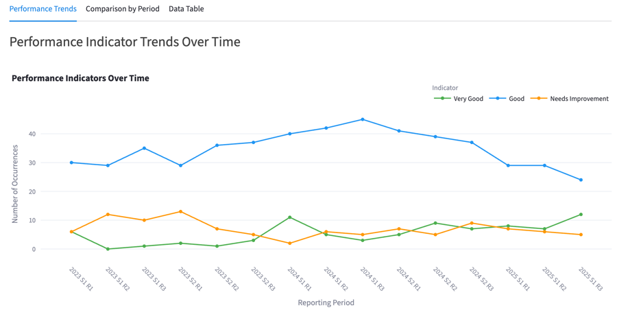

# 📊 School Reports Analytics Web App

A Streamlit web application that processes school report PDFs to extract key metadata and performance indicators. The app visualizes performance trends using interactive charts and allows users to export cleaned data to CSV.

🔗 **Live Demo:** [https://educationreportanalyser.streamlit.app/](https://educationreportanalyser.streamlit.app/)

---

## 📄 What It Does

- Upload multiple school reports in PDF format  
- Extract metadata: Year, Semester, Report Number  
- Analyze performance indicators: Very Good, Good, Needs Improvement  
- Visualize trends over semesters and years  
- Export structured data to CSV  

---

## 🧰 Key Features

- 📂 Supports batch PDF uploads  
- 🧠 Regex-based metadata extraction  
- 🗂 Table-based performance analysis using PyMuPDF  
- 📊 Interactive charts using Plotly  
- 🔒 Privacy-focused: all processing is in-memory  
- 🛠️ Modular, scalable Python code structure  

---

## 🧩 Notes

- This project is designed to be a **flexible foundation** for school reporting and can be extended to handle other structured PDF types.  
- No personal student or teacher data is stored. All data is processed in-memory and cleared when sessions end.  
- The code is **intentionally modular and scalable** to allow easy expansion — new performance indicators, different PDF layouts, and additional export formats can be added without restructuring the core logic.  

---

## 🖼️ Example Output



---

## 🏗️ Optional Local Setup

**Clone the repository:**

```bash
git clone <repo_url>
cd education_report_analyser
```

Create a virtual environment and install dependencies:

```bash
python -m venv venv
source venv/bin/activate  # On Windows: venv\Scripts\activate
pip install -r requirements.txt
```

Run the Streamlit app:

```bash
streamlit run app.py
```

---

## ⚙️ Dependencies

- streamlit >= 1.22.0  
- pandas >= 1.5.3  
- numpy >= 1.24.3  
- matplotlib >= 3.7.1  
- plotly >= 5.14.1  
- PyMuPDF >= 1.21.1  

---

## 👤 About

Created by Brett C. as part of my document automation and AI workflow portfolio. I build modular, scalable Python tools that process, structure, and visualize complex document data. This project is designed as a reusable, privacy-conscious solution that can be expanded for broader document types.

---

## 📝 License

MIT